The process of buying cryptocurrencies is a non-trivial undertaking especially for those new to the space. 
In this article, I aim to provide a simple step-by-step guide for buying Ada via the cryptocurrency exchange Kraken.
I will also show you how to securely store your Ada in Cardano's native wallet, Daedalus.
 
 

## Introduction to Kraken

Kraken is a highly reputable exchange which offers very low transaction fees and a great customer experience.
The company is intently focused on security and unlike many other exchanges has never been hacked.
 

Kraken also holds full reserves of its customer funds and employs independent audits to prove to third parties and its customers that funds are properly held.
You can be confident that Kraken is one of the safest and cheapest ways to purchase cryptocurrency today.
 
 

### The downside of using Kraken

The only downside to using Kraken is that the process of funding your account is somewhat inconvenient.
Unfortunately for residents of Canada, purchasing crypto using a credit card is not an option yet.
 

Instead, you have to send a wire transfer to the exchange.
This involves making a visit to one of your bank's branches and having the teller draw up a wire that can take several days to arrive.
 

While this can be annoying, the only other real option (in Canada at least) is to use [Coinmama](coinmama.com).
Coinmama charges a 10% fee to buy Ada with your credit card.
This is a substantial price to pay for convenience, especially if you are sending a considerable amount of money.
 

It makes sense to use Coinmama if you are planning to invest less than $500.
A wire transfer will cost you between $30 and $40 depending on your bank, plus another $12.50 which Kraken's bank charges.
This ultimately amounts to more than 10% when sending less than $500.
 

In this guide we will only go over using Kraken to buy Ada.
Coinmama is fairly straightforward to use so you should be able to figure it out easily enough.
 
 

## Creating an account on Kraken

The first step to buying Ada is to make an account on Kraken. 
Go to the sign-up page [here](https://www.kraken.com/sign-up) and fill out the form with your email, username and password.
Make sure to choose a password which you don't use for any other sites.
 

I know this can make it annoying to remember but it's well worth maximizing your security when it comes to cryptocurrencies.
There are too many tragic stories of people losing all of their funds to clever hackers. 
 

I highly suggest getting a piece of paper at this point to write down your email, username, password and a lot of other information which will come up throughout this article.
**DO NOT** save any of your credentials on an internet connected device as once again, this exposes you to the risk of being hacked.
Old fashioned paper is best.
 

After submitting the initial sign up form, you will need to activate your account through an email sent by Kraken.
Following activation, you should be able to login and will be brought to Kraken's main page.
 

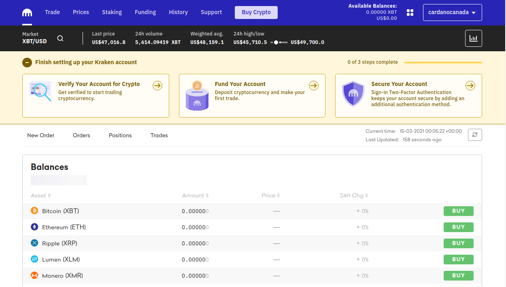
 
 

## Finish setting up your account

One of the first things you will notice is a banner near the top prompting you to finish setting up your account.
The three steps listed are each important and we will go through them one at a time.
 

### Verifying your account

The first step is to verify your account.
In order to send fiat money (ie Canadian or U.S. dollars) to the exchange, Kraken requires you to get an intermediate level account.
This involves a simple 4-5 minute process where you verify your identity by providing additional personal information such as address, photo id and proof of residence.
 

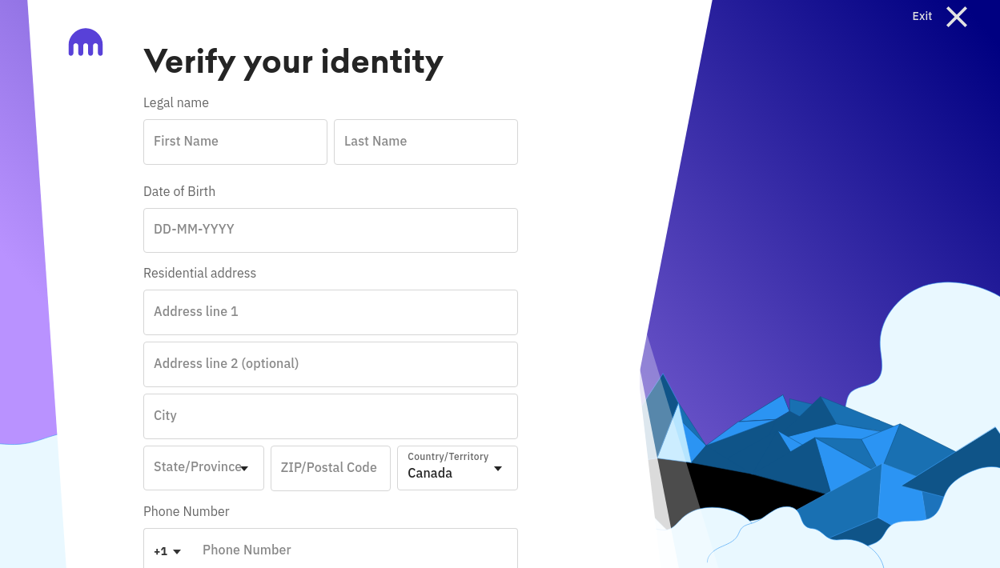
 

The photo id can be a driver's license or passport while the proof of residence can be a bank statement, utility bill or credit card statement.
I found it easiest to download a credit card statement from my bank account online.
Approval for the intermediate level account should be instantaneous.
 

### Activating two-factor authentication

After getting access to your intermediate level account, you are ready to send money to Kraken!
Before we get to that however, it's important to first secure your account by enabling two-actor authentication.
Enabling two-factor authentication (2FA) makes it virtually impossible for anyone to access your account without first getting access to your phone.
 

You can find the 2FA settings by heading back to the main page and clicking on the last item in the *"Finish setting up your Kraken account"* banner.
Similarly, you can the page by clicking your **Name** in the top right corner, clicking **Security** and then selecting **2FA Settings**.
 

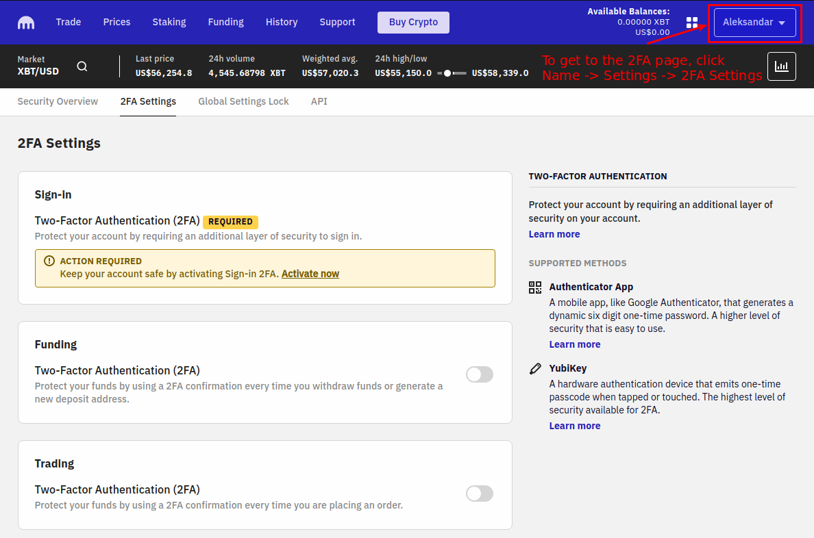
 

On this page you'll notice you can activate 2FA for various actions including sign-in, funding and trading.
Sign-in 2FA is the most important one to activate but feel free to do it for the other options if you want added layers of security.
 

In order to activate 2FA you need to download a 2FA app to your phone. 
Kraken recommends **Google Authenticator** and this is the one I use myself.
Once you have it downloaded, you can proceed with activating Sign-in 2FA.
 

While this is fairly straightforward, there is one non-obvious step you should take to ensure you can always access your account.
In the window that pops up, you should see a QR code. 
**DO NOT** use Google Authenticator to to scan the code.
If you lose your phone or accidentally delete the Google Authenticator app, you will not be able to get into your account.
 

Instead, click the "View Setup Key" button under the QR code. 
A string of letters and numbers will appear underneath.
On the same piece of paper you used to write down your username and password, write down this setup key.
 

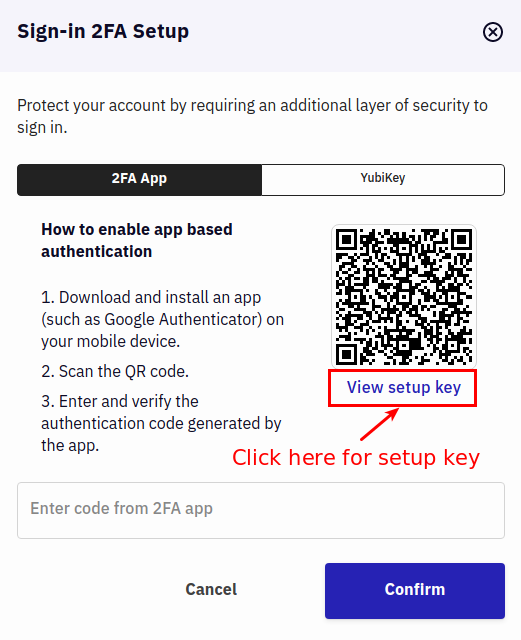
 

From there, open the Authenticator app and select *"Enter a setup key"*. 
On my android device, I find this option by clicking a plus sign on the bottom left of the screen.
 

Fill in the account name section with *"Kraken Sign-in"* and enter the setup key by copying it **from the piece of paper**.
This way you can be sure you wrote it down correctly!
Now even if you lose your phone, you can restore your 2FA code by re-inputting the setup key.
 

Once you're finished, you should see a six digit code pop up in the Authenticator app. 
Enter this code into the corresponding box on Kraken and you should be all set!
 

### Funding your account

Now that your account is fully setup and secure, it's time to send the wire transfer!
First we need to save the info you're going to show the teller at the bank.
 

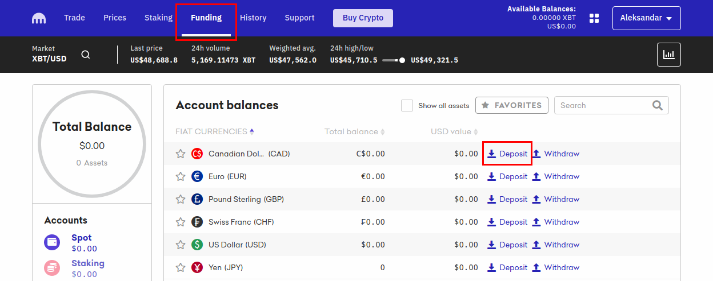
 

In the menu bar at the top of Kraken's website, click funding.
This brings you to a page showing your account balances which should all be zero at this point :(
 

To fix this, click the deposit button next to the currency you are interested in depositing.
There are several options available for depositing funds in each currency. 
In Canada, the best option is the Credit Union Atlantic wire.
 

After selecting this option, Kraken will display instructions for proceeding with your wire.
I suggest reading them very carefully.
 

Next, take a screenshot of all the account information provided by Kraken for sending the wire.
Email or otherwise send the screenshot to yourself so that it's readily available on your phone when you go to the bank.
 
 

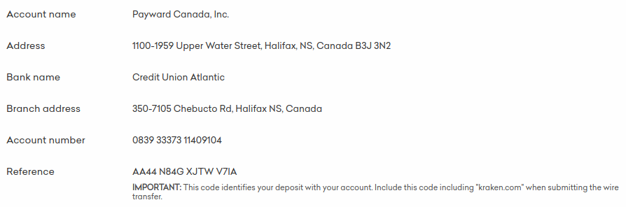
 

At the bank, I suggest opening the screenshot on your phone and giving it to the teller.
If they're competent, they will know exactly how to fill out the wire based on that information.
 

The one piece of information they will not be familiar with is the reference number. 
This is the number that links your wire to your Kraken account and is very important.
 

Instruct the teller to enter the reference number in the wire's **payment intructions**.
In my experience, entering it in either the bank's or end recipient's payment instructions works but just use the end recipient.
After they have done this, ask them to read it back to you as you will not be able to verify the reference number's correctness later.
 

The teller will print out the finalized wire and ask you to sign that the information is correct.
Definitely take the time to check over the teller's typing as it could be costly if any of the information is incorrect.
 

Your money should arrive within 2-4 business days and Kraken will send you an email when it does. 
If you have not received your funds after 6 days, it's probably time to reach out to Kraken.
One last thing to note, Kraken's bank currently takes $12.5 dollars to process the wire on their end so don't be surprised if you're missing that from your balance in Kraken.
 
 

## Purchasing Ada on Kraken

Recently Kraken has made it very easy for beginner's to purchase crypto on its platform. 
In the top menu bar, there is now a big button labelled *"Buy Crypto"*.
This easy-to-use interface allows you to buy, sell, or convert crypto instantly without the hassle of placing orders via the trade interface.
 

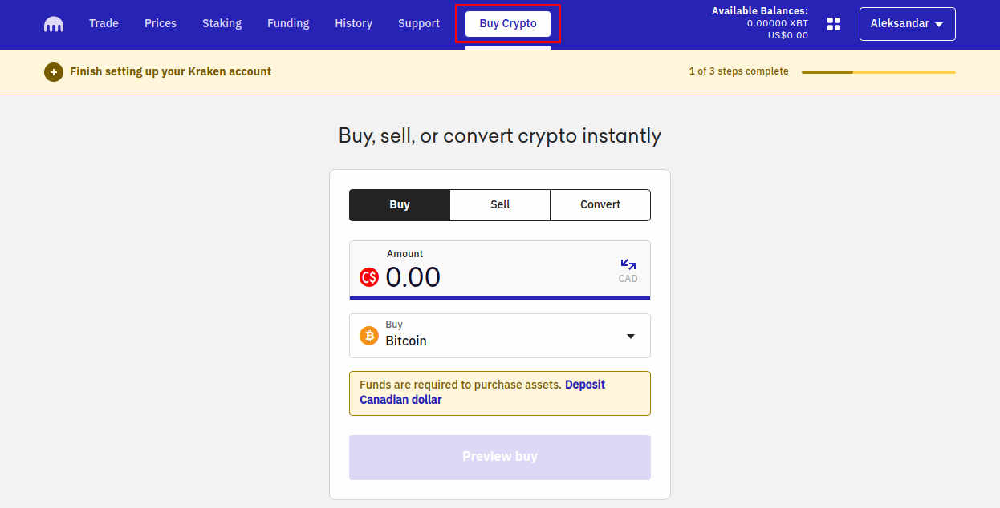
 

The one complicated aspect in buying Ada on Kraken at the moment, is the lack of a CAD/ADA trading pair.
This means you cannot directly buy Ada with Canadian dollars.
 

Instead, you must first buy Bitcoin and then buy Ada with your Bitcoin.
This is slightly inconvenient and more costly but it is what it is.
Hopefully as Ada gains in popularity, Kraken will add a CAD/ADA trading pair.
 

As the first step, click the *Buy* tab on the screen and enter the amount of Canadian dollars you wish to spend.
If you wish spend all of your CAD in one go, you can go to the *Funding* page to see exactly how much CAD you have.
 

Next, select Bitcoin as the cryptocurrency to purchase.
You could buy Ethereum instead and then buy Ada.
However, there is generally more volume / liquidity with Bitcoin trading pairs so you will be paying closer to market value by Bitcoin.
 

Finally, select the *Convert* tab on the *"Buy Crypto"* page.
Select Bitcoin and Ada in the corresponding *From* and *To* drop down menus and enter the amount of Bitcoin you previously purchased.
Once again, your full Bitcoin balance should be visible on the *Funding* page.
 

Once you've succesfully completed this last step, you are officially a proud owner of some Ada!! Congrats on making it this far!
 
 

## Transfering your Ada out of Kraken

There are several reasons to transfer your Ada out of Kraken.
 

The most important reason is so that you can stake it!
The [concept of staking](https://cardano.org/stake-pool-delegation/) deserves its own article but all you need to know right now is that you can earn 5% per year on your Ada by staking.
Think of it as interest paid to you by the network for keeping it secure.
We will go over staking shortly.
 

The second reason for moving your Ada is that it is generally bad practice to keep your funds on any exchange for long periods of time. 
While Kraken is very secure, exchanges are prime targets for hackers and Kraken will never be immune to potential security vulnerabilities. 
 

Furthermore, having your crypto on an exchange means you don't technically have control over it.
Yes Kraken is very reliable and has no intention of screwing over its customers but the whole point of crypto is to not have to rely on a third party to hold your money.
 

There is a popular saying in the crypto space: "Not your keys, not your crypto". 
Unless you own the wallet keys holding your crypto, you are not truly in control of it.
 
 

## Wallet options for storing Ada

There are currently two good wallet options for storing your Ada: Daedalus and Yoroi.
 

 

Daedalus is an open source wallet primarily developed by Input Output Global (IOG) - the company heading the development of Cardano itself.
It is a full-node desktop wallet meaning it stores a copy of the entire blockchain on your computer.
You can download it from this [link](https://daedaluswallet.io/en/download/).
 

The other option is Yoroi which is mobile wallet available on both the Apple App Store and Google Play Store.
Yoroi is developed by IOG's sister company Emurgo and is a light wallet meaning it doesn't store a full copy of the blockchain on your device.
You can find it by searching in the app store on your phone.
 

Both wallets are beautifully designed and easy to use. 
However, I prefer Daedalus for long term storage of my Ada and that's the one I will teach you to use. 
 
 

## Creating a wallet on Daedalus

Download Daedalus from this [link](https://daedaluswallet.io/en/download/) by selecting the version corresponding to your operating system.
Next, install Daedalus and open the application. 
There is an intial setup and license agreement window to click through before you get to the main application page.
 

Once there you will be met with the following window:
 

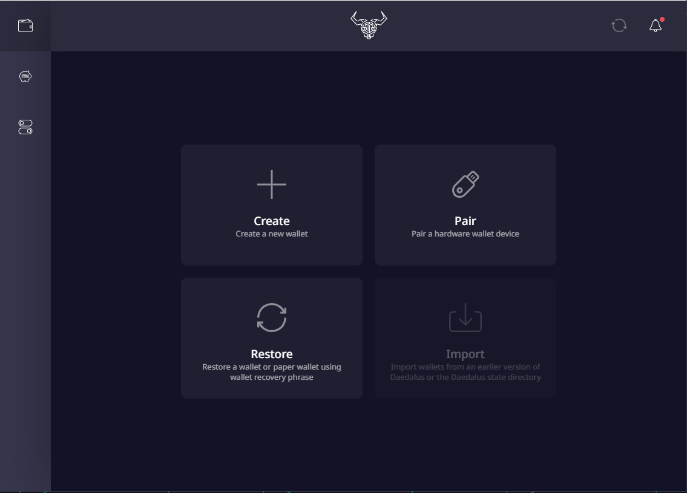
 

Daedalus should immediately begin downloading a copy of the Cardano blockchain.
In the top right corner, there is a spinning wheel which you can hover over to see how far along Daedalus is in synchronising with the blockchain.
This process can take up to 2-3 hours depending on the bandwidth of your internet connection.
It will also consume around 7 GB of space on your hard drive as of March 2021.
 

While this may seem heavy, realize that you are downloading every transaction that has ever happened on the Cardano blockchain.
From this perspective, it is quite impressive that the uses as little storage and bandwidth as it does. 
 

While Daedalus is synchronising, let's create a new wallet.
Click the *Create* button on the main page.
You will be prompted to name your wallet (anything you'd like) and to create a spending password.
 

Your spending password essentially prevents someone who gains access to your computer from being able to send funds from your wallet.
Once again, choose something secure which you don't use elsewhere and write it down on that handy piece of paper.
Then click *"Create Shelley wallet"*.
 

This next step may be the most important one in the entire article.
Daedalus is about to provide you with a recovery phrase consisting of 24 words.
These 24 words are the only thing that matters when it comes to keeping your funds in Daeadalus secure.
If you misplace them or a hacker gets a hold of them, you WILL lose all of your Ada stored in that wallet.
 

You can use these 24 words to restore your wallet on any computer that has Daedalus installed.
I would keep no more than two paper copies of this phrase stored in physically distinct locations.
Do not store them on any device with an internet connection.
 

Personally, I keep one hidden in my home and the other in a lock box at the bank.
These funds could potentially worth a lot in the future so you want to take this seriously.
 

Daedalus will test to make sure you have indeed written down your recovery phrase before finally initializing your wallet.
Congrats! You now have your very own wallet on the Cardano blockchain! 
Now let's put some money in there baby :)
 
 

## Withdrawing your funds from Kraken

Kraken makes it very easy to withdraw your funds.
One thing to note before trying this step is that Kraken will not let you withdraw funds within 72 hours of your first deposit.
 

To start, head over to the *Funding* page again.
Your Ada balance should be visible as a row under *"Crypto Assets"*.
This time we're going to click the *Withdraw* button which should take you to the following page:
 

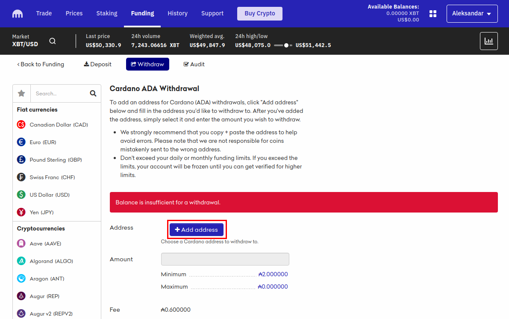
 

Next we need to add your Daedalus wallet address to Kraken.
Click *"+ Add address"* which will bring you to a page with two input boxes.
 

The first is a description for your wallet.
This can be anything but I would keep it consistent with what you named your wallet in Daedalus.
 

The second input box is for your actual wallet address.
To get this address, head over to the Daedalus application and select your wallet.
At the top there are several tabs with different views of your wallet.
Select the *Receive* tab.
 

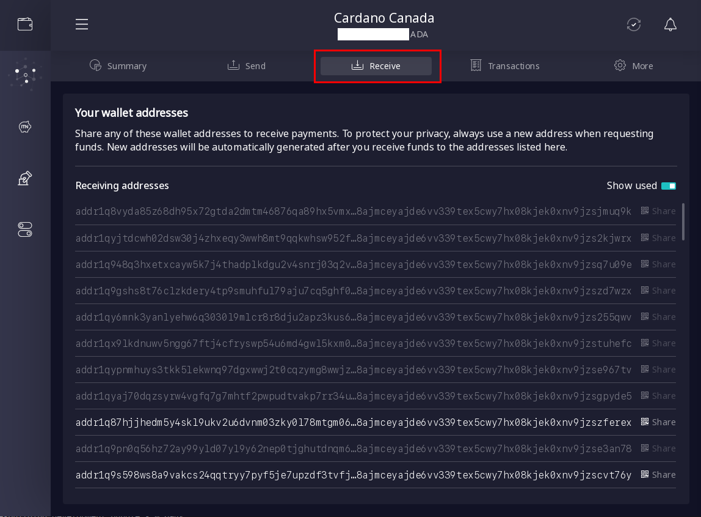
 

As you can see, there are many recieving addresses associated with your wallet.
Simply click on one and then press the *"Copy address"* button under the long string of characters representing your address.
 

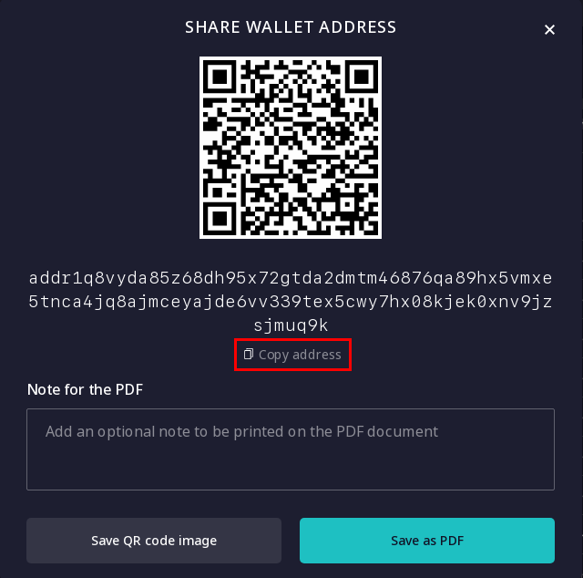
 

Now that you have the address copied to your clipboard, head back over to Kraken and paste it in the *"Cardano address"* input box.
After pressing *"Save address"*, Kraken will send you an email to confirm that you were indeed the one to add the new address.
Click the link sent in the email which should verify the new Cardano address.
 

Now head back to Kraken and select the new wallet address from the dropdown menu.
Finally enter the amount you would like to withdraw and press *"Withdraw"*.
It should take around 2-3 minutes for Kraken to process the withdrawal and for funds to appear in your Daedalus wallet.
 
 

## Staking your Ada

Congrats on making it this far!
We are almost done.
The last step is to stake your Ada to a staking pool.
As I mentioned before, doing this helps to secure the network while earning you approximately a 5% annual return on your Ada.
 

In order to stake, click the network tab on left hand side of the Daedalus application and then select the *"stake pools"* tab at the top.
 

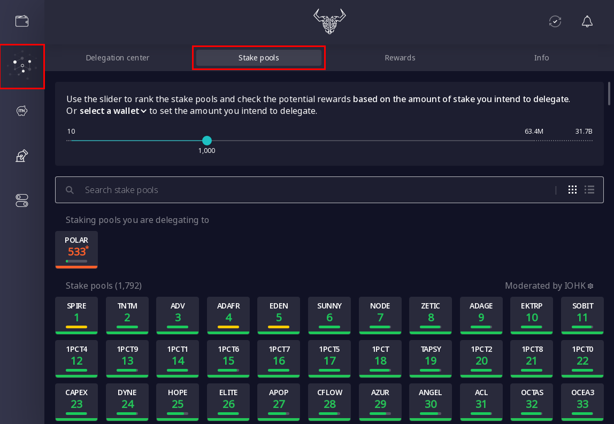
 

From this interface you can search through the various stake pools which maintain the Cardano blockchain.
Daedalus ranks pools according to saturation (amount staked), blocks produced and several other factors which are not entirely transparent.

Unfortunately for smaller pools, the metrics used for this ranking favour larger, more established pools.
Just because a pool is not ranked very high in Daedalus does **not** mean it's a bad pool.
The difference in your annual return on Ada between the highest ranked pool and a medium ranked pool is very small if not inconsequential.

The important things to consider when delegating to a pool are the fixed cost, margin and pledge.

Pledge is something that each stake pool owner/operator is required to commit to the stake pool. 
This is essentially their private resources and is locked in that respective pool. 
In the simplest terms, it proves how much 'skin' each operator/owner has in their pool. 
While higher pledge is better, anything over 50k Ada is plenty good.

Fixed cost and margin are a little more difficult to explain but basically these values correspond to amount of Ada the stake pool operator is rewarded for running the pool.
As a delegator, the lower the fixed cost and the lower the margin, the better.

₳340 is the minimum possible fixed cost an operator can charge.
Most operators use this minimum fixed cost however some do choose to make it higher.
3% is a reasonable margin while 1% or less would be considered a low margin. 

To better understand fixed cost and margin, let's say that a pool produces some blocks and receives a total of ₳10,000 in rewards. 
If the fixed cost is ₳340 then this will immediately be subtracted from the total and rewarded to the owner/operator.

Using the ₳9,660 remaining, the marginal cost is calculated.
If the margin is 1%, this amounts to ₳96.6.
The remaining amount (₳10,000 - ₳340 - ₳96.6 = ₳9,563.4) goes to the delegaters and is distributed proportional each person's stake.

As you can see, the cost per epoch is not paid per delegater, but is a fixed fee the pool takes from the total rewards.
Also this makes it obvious why bigger pools are ranked higher